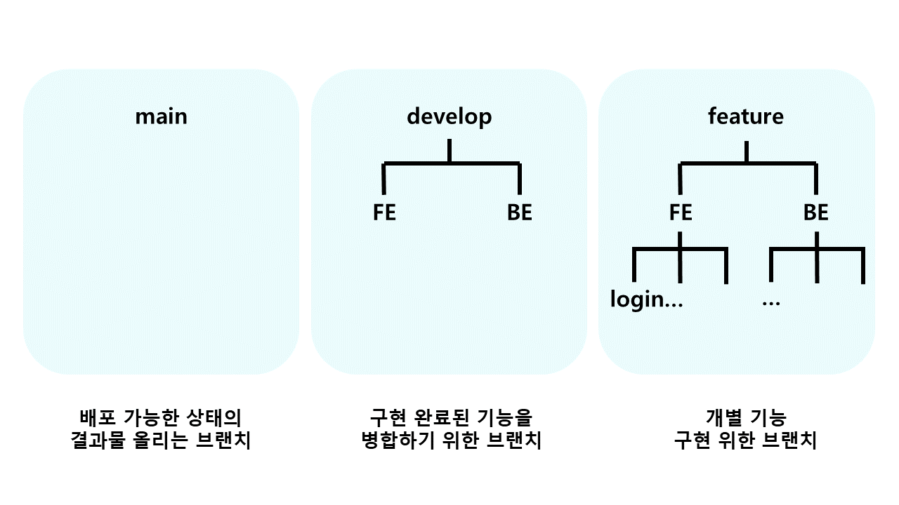

# 웹/모바일(웹 디자인) 스켈레톤 프로젝트

<!-- 필수 항목 -->

## 카테고리

| Application | Domain | Language | Framework |
| ---- | ---- | ---- | ---- |
| :black_square_button: Desktop Web | :black_square_button: AI | :white_check_mark: JavaScript | :white_check_mark: Vue.js |
| :white_check_mark: Mobile Web | :black_square_button: Big Data | :black_square_button: TypeScript | :black_square_button: React |
| :black_square_button: Responsive Web | :black_square_button: Blockchain | :black_square_button: C/C++ | :black_square_button: Angular |
| :black_square_button: Android App | :black_square_button: IoT | :black_square_button: C# | :black_square_button: Node.js |
| :black_square_button: iOS App | :black_square_button: AR/VR/Metaverse | :white_check_mark: Python | :white_check_mark: Flask/Django |
| :black_square_button: Desktop App | :black_square_button: Game | :white_check_mark: Java | :white_check_mark: Spring/Springboot |
| | | :black_square_button: Kotlin | |

## 프로젝트 소개

* 프로젝트명: 웹 큐레이션 SNS
* 서비스 특징: 웹/모바일(웹 디자인) 프로젝트를 위한 스켈레톤 프로젝트
* 주요 기능
    - 계정 관리
    - 검색 기능
    - 뉴스피드 기능
* 주요 기술
    - Single Page Application
    - CSS, SASS
    - REST API
* 참조 리소스
    * sass-loader: scss 로드 및 컴파일
* 배포 환경
    - URL: // 웹 서비스, 랜딩 페이지, 프로젝트 소개 등의 배포 URL 기입
    - 테스트 계정: // 로그인이 필요한 경우, 사용 가능한 테스트 계정(ID/PW) 기입

<!-- 자유 양식 -->

## 팀 소개
* 이현욱: 팀장, BE개발
* 인영교: 부팀장, BE 개발, 배포 담당
* 최준서: BE 개발
* 이다영: FE 개발
* 강동혁: FE 개발
* 여현빈: FE 개발

<!-- 자유 양식 -->

## 프로젝트 상세 설명

// 개발 환경, 기술 스택, 시스템 구성도, ERD, 기능 상세 설명 등

## ✔ **Git 커밋 메시지 컨벤션**

- `Feat` : 새로운 기능 추가
- `Modify` : 기존 기능 수정
- `Fix` : 버그 수정
- `Docs` : 문서 내용 변경
- `Style` : 포맷, 세미콜론 수정 등 코드가 아닌 스타일에 관련된 수정
- `Refactor` : 코드 리팩토링
- `Test`: 테스트 코드 추가 및 리팩토링 테스트 등
- `Build` : 빌드 관련 파일 수정
- `Chore` : 코드 의미에 영향을 주지 않는 변경사항 (포맷, 세미콜론 누락, 공백 등)
- `CI` : CI 관련 설정 수정에 대한 커밋
- 커밋 타입은 **대문자**로 시작하며, 항상 대괄호 안에 파트를 입력하여 시작
- 관련된 지라 이슈 번호에 괄호를 붙여 뒤에 추가.

ex) **[BE] Feat: 관심지역 알림 ON/OFF 기능 추가(#123)**

 

## ✔ **Git 브랜치 컨벤션**

- `main`
    - 배포 가능한 상태의 결과물 올리는 브랜치
- `dev`
    - 구현 완료된 기능을 병합하기 위한 브랜치
    - 통합 폴더의 기능
- `feat`
    - 개별 기능 구현 브랜치
    - 기능 개발 완료 시 삭제
    - 네이밍 규칙
        - feature/FE or BE/기능이름
        - 예) feature/FE/login
            
- **feature 브랜치가 완성되면 develop 브랜치로 merge request를 통해 merge한다.** 
  ⇒ merge request가 요청되면, 모든 팀원들이 코드 리뷰를 하여 안전하게 merge한다.

 