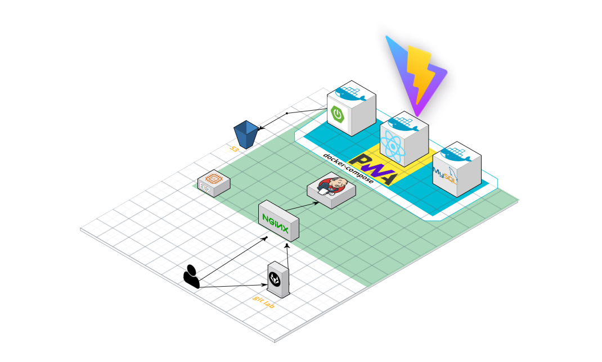

# 🍻 NeighBrew - 취향 맞는 술 모임과 다양한 주종 정보를 한 자리에서


## NeighBrew 링크(모바일에 최적화 되어있습니다) </br> : [도메인](https://i9b310.p.ssafy.io/)

## 소개 영상 보기 : [UCC 링크]()

## 🥃 프로젝트 진행 기간

2023.07.04(화) ~ 2023.08.18(금)
</br>
SSAFY 9기 2학기 공통 프로젝트

</br>

## 🍺 NeighBrew - 배경

다양한 주종은 접해보고 싶은데, 술에 대한 정보가 없어 포기하신 적이 있으시지 않으신가요?

</br>
혹은, 특정 한 술을 마셔보고 싶지만 함께 먹을 사람이 없어 포기하시지 않으셨나요?

음주에 대한 취향과 취미를 포기하지 않고 이어나가고 싶은 당신을 위해 준비했습니다.

</br>

## 🍹 NeighBrew - 개요

_- 취향 맞는 술 모임과 다양한 주종 정보를 한 자리에서 즐길 수 있도록 -_

**NeighBrew**은 당신의 음주 취향에 맞는 사람들과 모임을 조성하고 이를 통해 주종에 대한 이해 및 취미 생활을 독려하는 SNS 플랫폼 입니다.

. 양주와 와인과 같은 주종에 대한 시장은 최근 3년간 폭발적으로 성장하고 있습니다.
</br>하지만 성장해가는 시장에 맞는 플랫폼의 부재로 사용자들은 **스스로 모임을 모집** 및 **흩어져있는 정보를 수집** 하며 취미 생활을 이어나가고 있습니다.

.저희는 이러한 문제점을 해소하고 다양한 술에 대한 정보를 객관적 ,주관적 (후기) 데이터를 제공하며 취향 맞는 사람들과의 모임을 가능하게 합니다.
</br>
뿐만 아니라 자신이 경험한 술들은 자신의 술장에 들어가 자신이 경험한 술을 영원히 기억할 수 있습니다.

## 🍷 주요 기능

## 술장

- 최상단 음주 관련 행사 배너를 출력합니다
  - "시음행사", "주류 박람회", "양조장 투어" 정보를 출력함으로 취미 생활을 이어나갈 수 있도록 독려 합니다.
- 중단에 서비스가 현재 제공하고 있는 술을 보여줍니다.
  - 후기를 남기고(보고) 싶은 술을 검색하여 해당 술에 대한 여러 유저의 주관적, 객관적 데이터를 수집할 수 있습니다.
- 하단에 현재 가장 인기있는 후기들을 보여줍니다.
  - 현재 유저들 사이에서 인기 있는 주종을 알 수 있으며 다양한 유저와 소통 할 수 있는 장을 제공합니다.
    <br/>

## 취향에 맞는 모임 조성

- 원하는 술에 대한 모임을 생성 및 참여 가능
  - 선호하는 연령, 간수치(매너지수), 인원, 장소, 시간 설정으로 맞춤 모임을 생성 및 참여가 가능합니다.
- 참여 신청
  - 자신이 원하는 모임을 발견 시 참여 신청이 가능합니다.
  - 방장은 들어온 신청을 보고 수락 및 거절이 가능합니다.
  - 모임에 참여하게 되면 단체 채팅방이 생성되어 모임 전까지 그라운드룰, 세부 정보 등을 공유할 수 있습니다.
    <br/>

## 마이 페이지(유저 페이지)

- 유저의 간수치(메너수치), 술병(자신의 경험한 술)을 확인 할 수 있습니다
- 유저의 팔로워/ 팔로잉 유저들을 확인 할 수 있습니다.
- 악성유저의 경우 신고기능을 제공합니다
- 유저와 관련된 모임들을 한 번에 확인 가능합니다
- 유저가 경험했던 술을 한 눈에 확인 할 수 있습니다.
  - 술을 모집하는 경험을 통해 재미요소를 추가할 예정입니다.
  - 해당 기능을 통해 해당 유저의 취향을 확인 할 수 있습니다.
- DM 기능을 통해 취향 맞는 사람과의 소통을 도모합니다.
  <br/>

## ✔ 주요 기술

**Backend - Springboot**

- IntelliJ
- MySQL DB
- Spring Boot
- stomp

**Frontend**

- React
- Redux

**Environment**

- AWS EC2
- NGINX
- SSL
- Docker

## ✔ 프로젝트 구조



## ✔ 프로젝트 파일 구조

### Frontend

```
cmd 활용해서 만들자
```

### Backend

```

```

## ✔ 협업 툴

---

- Gitlab
- Notion
- JIRA
- MatterMost
- POSTMan
- GitMInd
- Canva

## ✔ 협업 환경

- Gitlab
  - 코드 버전 관리
  - 이슈 발행, 해결을 위한 토론
  - MR시, 팀원이 코드리뷰를 진행하고 피드백 게시
- JIRA
  - 매주 목표량을 설정하여 Sprint 진행
  - 업무의 할당량을 정하여 Story Point를 설정하고, In-Progress -> Done 순으로 작업
  - 소멸 차트를 통해 프로젝트 진행도 확인
- 회의
  - 각자 위치에서 건네야 할 말이 생기면 팀원의 위치로 이동하여 전달
  - 빠른 소통과 신속한 대응 가능
- Notion

  - 회의가 있을때마다 회의록을 기록하여 보관
  - 회의가 길어지지 않도록 다음날 제시할 안건을 미리 기록
  - 기술확보 시, 다른 팀원들도 추후 따라할 수 있도록 보기 쉽게 작업 순서대로 정리
  - 컨벤션 정리
  - 간트차트 관리
  - 스토리보드, 스퀀스다이어그램, 기능명세서 등 모두가 공유해야 하는 문서 관리

- POSTMan
  - POSTMan 이용해 필요한 API 테스트 및 실행
  - API 변동 사항을 한눈에 볼 수 있으며, 인수 또는 반환값 스키마를 제공

## ✔ 팀원 역할 분배


## ✔ 프로젝트 산출물 (이미지나 URL 연결 필요 )

---

- [기능명세서]() 완
- [플로우차트]() 추후
- [아키텍처]() 추후
- [와이어프레임]() 추후
- [커밋 컨벤션]()
- [API]() 추후
- [ERD]() 완
- [회의록]() 추후
- [시스템기술서]() 추후

## ✔ 프로젝트 결과물

- [중간발표자료]()
- [최종발표자료]()

## 🎵 NeighBrew 서비스 화면

### 메인화면(술장)

-


### 로그인

-


### 프로필 변경

-


### 모임 등록

- 

### 술장

-


